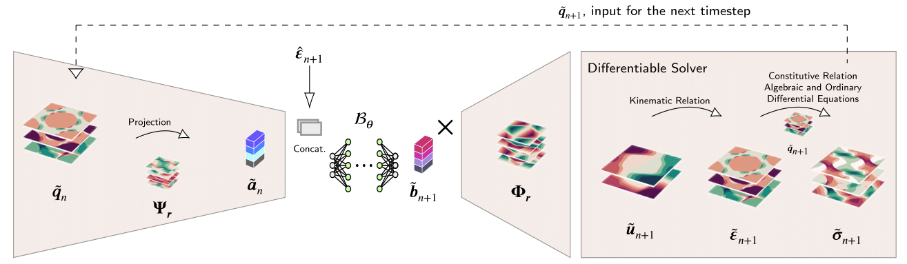

# Hybrid-AI-Model-for-rate-dependent-simulations

## Abstract

The behavior of materials is influenced by a wide range of phenomena occurring across various time and length scales. To better understand the impact of microstructure on macroscopic response, multiscale modeling strategies are essential. Numerical methods, such as the FE² approach, account for micro-macro interactions to predict the global response in a concurrent manner. However, these methods are computationally intensive due to the repeated evaluations of the microscale.

This challenge has led to the integration of deep learning techniques into computational homogenization frameworks to accelerate multiscale simulations. In this work, we employ neural operators to predict the microscale physics, resulting in a hybrid model that combines data-driven and physics-based approaches. This allows for physics-guided learning and provides flexibility for different materials and spatial discretizations.

We apply this method to time-dependent solid mechanics problems involving viscoelastic material behavior, where the state is represented by internal variables only at the microscale. The constitutive relations of the microscale are incorporated into the model architecture, and the internal variables are computed based on established physical principles. The results for homogenized stresses (less than 6% error) show that the approach is computationally efficient (approximately 100× faster).

📎 **Paper link**: [Read the full paper](arxiv)

## 📊 Dataset Access

The dataset used for training is hosted on Zenodo:  
🔗 [https://doi.org/10.5281/zenodo.15676985](https://doi.org/10.5281/zenodo.15676985)

Please download the files and place the files in the data/ folder before running the training scripts.

## ▶️ Getting Started

bash
# Clone the repo
git clone https://github.com/Dhananjeyan-Github/Hybrid-AI-Model-for-rate-dependent-simulations.git
cd Hybrid-AI-Model-for-rate-dependent-simulations

# Install dependencies
pip install -r requirements.txt

# Run training
python training_parallel.py